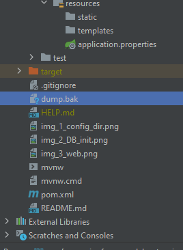
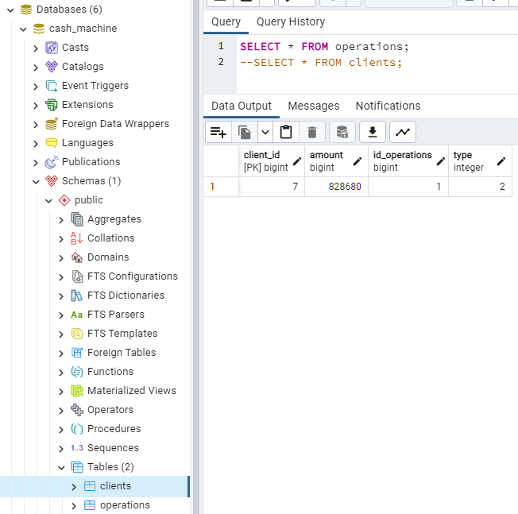
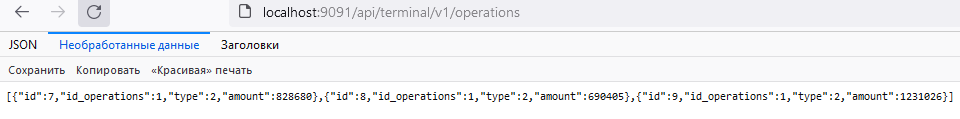

### ФИНАЛЬНЫЙ ПРОЕКТ
*Этап 1*

API для Интернет-банка  
Задача: реализовать Rest API по работе с банковским счетом.  
Это API будет использовать банкомат, веб-приложение или мобильное приложение Интернет-банка.  
Будут доступны следующие операции:
- Узнать баланс по ID пользователя;
- Снятие заданной суммы с баланса пользователя;
- Пополнение баланса на заданную сумму;
- Отобразить список операций за выбранный период;
- Перевести заданную сумму другому пользователю.

Ответ выдается в виде JSON.
___
#### Прежде чем подключаться к БД из программы, нужно в консоли PSQL настроить права доступа:
```
cd G:\prog\postgres\postgresql_14.1\pgsql\bin\
# синтаксис консоли Powershell 7 немного похож на Linux
.\psql -U postgres
# просмотрим всех пользователей
select * from pg_user;
# создадим пользлвателя с привилегиями управлять базами.
# Добавление новой роли (пользователя):
CREATE USER cash WITH PASSWORD 'myPass';
# даем права
GRANT ALL PRIVILEGES ON DATABASE "cash_machine" to cash;
# Теперь подключаемся к базе, к которой хотим дать доступ:
\c cash_machine
# Так мы добавим все права на использование всех таблиц в базе cash_machine учетной записи cash:
GRANT ALL PRIVILEGES ON ALL TABLES IN SCHEMA public TO "cash";
# вот так зададим роль Superuser (вероятно, с этого надо было и начать)
ALTER ROLE cash WITH Superuser;
# Выходим из SQL-оболочки:
\q
```
#### управляем жизненным циклом проекта в консоли:
```mvn spring-boot:run  
mvn spring-boot:run
# Builds with 4 threads
mvn -T 4 clean spring-boot:run
# 2 thread per cpu core
mvn -T 2C spring-boot:run
mvn package
mvn clean package
mvn -T 4 clean package
java -Dfile.encoding=windows-1251 -jar target/pos-0.0.1-SNAPSHOT.jar
mvn clean package spring-boot:repackage
# 
java -jar silent-0.0.1-SNAPSHOT.jar
```
#### Логин, пароль и порт берем из файла *application.properties*  
Соответственно, параметры подключения к базе данных можно изменить.  
А запустить .jar файл с указанием откуда читать *application.properties* можно так:  
```java -jar silent-0.0.1-SNAPSHOT.jar --spring.config.location=optional:file:./config/```
  
Например, в данном примере он находится в подкаталоге /config текущего каталога запуска.

просмотреть содержимое архива:  
```jar tvf target/pos-0.0.1-SNAPSHOT.jar```  

Запускаем программу.
---
``` mvn -T 4 clean spring-boot:run ```  
Посмотрим как инициализировалась БД  

и выполним запрос:  
```select * from clients;```  
Тестируем REST API CRUD операции:
1. Создадим клиента. HTTP Method: POST  
```curl -X POST -H "Content-Type: application/json" -d '{"balance":"10888"}' http://localhost:9091/api/terminal/v1/clients```  
2. Найти клиента по ID REST API. HTTP Method: GET  
```curl http://localhost:9091/api/terminal/v1/clients/2```  
3. Найти всех клиентов REST API. HTTP Method: GET  
```curl http://localhost:9091/api/terminal/v1/clients```  
4. Обновить данные клиента REST API. HTTP Method: PUT  
```curl -X PUT -H "Content-Type: application/json" -d '{"balance":"330888"}' "http://localhost:9091/api/terminal/v1/clients/2"```  
5. Удалить клиента REST API HTTP Method: DELETE  
```curl -X DELETE -H "Content-Type: application/json" http://localhost:9091/api/terminal/v1/clients/1```  

Смотрим JSON ответ нашего REST сервиса в браузере:  
```http://localhost:9091/api/terminal/v1/clients```  


Дамп схемы БД лежит в корне проекта:  

___
*Этап 2*  
Реализуем getOperationList  

_Шаг 1. Создание таблицы с операциями_  
Создайте таблицу для хранения списка операций.  
Таблица должна хранить ID операции, ID пользователя, тип операции (целое число) и сумму (целое число).
Первичный ключ — ID операции, вторичный ключ — ID пользователя. Между таблицей с операциями и таблицей с балансом должна быть связь по вторичному ключу — ID пользователя.
Если у вас возникли сложности при выполнении этого задания, повторите модули по SQL.

_Шаг 2. Доработайте класс по работе с базой данных_  
1. Доработайте функции putMoney и takeMoney в вашем классе по работе с БД. Теперь при каждой операции вы должны добавлять новое значение в вашу новую таблицу со списком операций.
2. Добавьте в ваш класс по работе с базой данных функцию getOperationList. Функция принимает ID пользователя и 2 даты и возвращает список операций за выбранный диапазон времени.
3. Предусмотрите возможность, чтобы одно или оба значения диапазона дат были пустыми. В этом случае функция будет выдавать все операции без фильтрации по дате.

⭐ Задание со звездочкой: сделайте так, чтобы обновление таблицы с балансом пользователя и добавление новой строки в список операций выполнялись в рамках одной транзакции. Это защитит вас от возможной неконсистентности данных, если случится какой-то сбой между двумя операциями. Например, уборщица случайно отключит ваш сервер шваброй после того, как вы обновили баланс пользователя, но еще не успели добавить строку в таблицу с операциями.

_Шаг 3.  Добавьте операцию getOperationList в Rest API_  
Добавьте новую операцию в ваш Rest API. Результатом работы будет JSON со списком операций за выбранный диапазон времени. Предусмотрите возможность вызывать эту операцию как с ограничениями по датам, так и без.
___
Структура таблицы для хранения списка операций    

В браузере Operations List отображается так:  
http://localhost:9091/api/terminal/v1/operations

___
*Этап 3*  
Добавляем возможность перевода денег  

Этот этап необязательный. Если вы чувствуете в себе силы и готовы усложнить ваше портфолио — вперед.
В противном случае можете остановиться на достигнутом.  
_Шаг 1. Доработайте структуру базу данных_  
Пожалуйста, самостоятельно придумайте, как нужно доработать базу данных, чтобы предусмотреть возможность перевода денег от одного пользователя другому.
_Шаг 2. Доработайте класс по работе с базой данных_  
Добавьте в ваш класс по работе с базой данных функцию transferMoney, которая принимает ID первого и второго пользователя, а также сумму для перевода. Не забудьте обработать ситуации, когда на счету у пользователя не хватает денег.  

⭐ Задание со звездочкой: сделайте так, чтобы обновление таблицы с балансом пользователя и добавление новой строки в список операций выполнялись в рамках одной транзакции. Это защитит вас от возможной неконсистентности данных.  
_Шаг 3. Добавьте операцию transferMoney в Rest API_  
Комментариев не будет, вы со всем справитесь! Добро пожаловать во взрослый мир разработки :)  
_⭐ Задание со звездочкой: найдите в интернете бесплатный хостинг (или хостинг с бесплатным  пробным периодом) и поддержкой PostgreSQL. Разверните там вашу базу данных и ваше Rest API._  
_⭐ Шаг 4. Покройте свое приложение тестами_  
Это задание со звездочкой. Если чувствуете в себе силы, то напишите:  
- юнит-тесты, которые будут вызывать все основные функции в вашем приложении;  
- интеграционные тесты, которые будут подключаться к вашему API и вызывать его операции.  
___
Тесты  
```mvn test```
