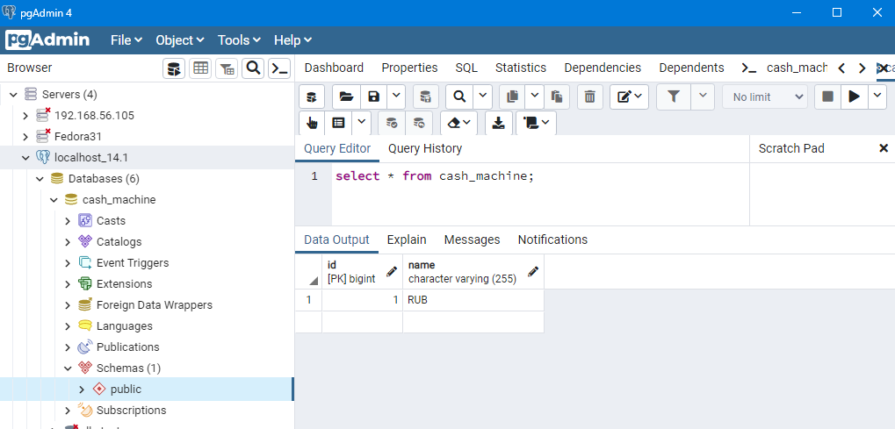

### ФИНАЛЬНЫЙ ПРОЕКТ
*Этап 1*

API для Интернет-банка  
Задача: реализовать Rest API по работе с банковским счетом.  
Это API будет использовать банкомат, веб-приложение или мобильное приложение Интернет-банка.  
Будут доступны следующие операции:
- Узнать баланс по ID пользователя;
- Снятие заданной суммы с баланса пользователя;
- Пополнение баланса на заданную сумму;
- Отобразить список операций за выбранный период;
- Перевести заданную сумму другому пользователю.

Ответ выдается в виде JSON.

управляем жизненным циклом проекта в консоли:
```mvn spring-boot:run  
mvn spring-boot:run
# Builds with 4 threads
mvn -T 4 clean spring-boot:run
# 2 thread per cpu core
mvn -T 2C spring-boot:run
mvn package
mvn clean package
mvn -T 4 clean package
java -Dfile.encoding=windows-1251 -jar target/pos-0.0.1-SNAPSHOT.jar
# 
java -jar silent-0.0.1-SNAPSHOT.jar
-- если application.properties находится в подкаталоге /config текущего каталога запуска .jar файла
java -jar silent-0.0.1-SNAPSHOT.jar --spring.config.location=optional:file:./config/

'C:\prog\java\spring_thymeleaf_layout\silent\target'

java -jar myproject.jar --spring.config.location=\
    optional:classpath:/application.properties,\
    optional:classpath:/override.properties
# Running the Application
mvn clean package spring-boot:repackage
java -jar target/spring-boot-ops.war
```
просмотреть содержимое архива:  
```jar tvf target/pos-0.0.1-SNAPSHOT.jar```

Прежде чем подключаться к БД из программы, нужно в консоли PSQL настроить права доступа:
```
cd G:\prog\postgres\postgresql_14.1\pgsql\bin\
# синтаксис консоли Powershell 7 немного похож на Linux
.\psql -U postgres
# просмотрим всех пользователей
select * from pg_user;
# создадим пользлвателя с привилегиями управлять базами.
# Добавление новой роли (пользователя):
CREATE USER cash WITH PASSWORD 'myPass';
# даем права
GRANT ALL PRIVILEGES ON DATABASE "cash_machine" to cash;
# Теперь подключаемся к базе, к которой хотим дать доступ:
\c cash_machine
# Так мы добавим все права на использование всех таблиц в базе cash_machine учетной записи cash:
GRANT ALL PRIVILEGES ON ALL TABLES IN SCHEMA public TO "cash";
# вот так зададим роль Superuser (вероятно, с этого надо было и начать)
ALTER ROLE cash WITH Superuser;
# Выходим из SQL-оболочки:
\q
```
Теперь можно запускать программу.  
Посмотрим как инициализировалась БД и выполним запрос:  
```select * from cash_machine;```


Открываем веб интерфейс нашего сервиса в браузере:  
http://localhost:9091/
Логин, пароль и порт берем из файла *application.properties*

Тестируем в консоли:
curl http://localhost:9091/login