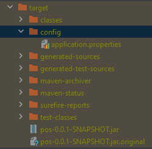
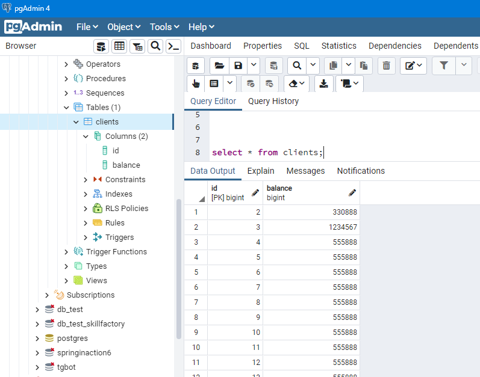
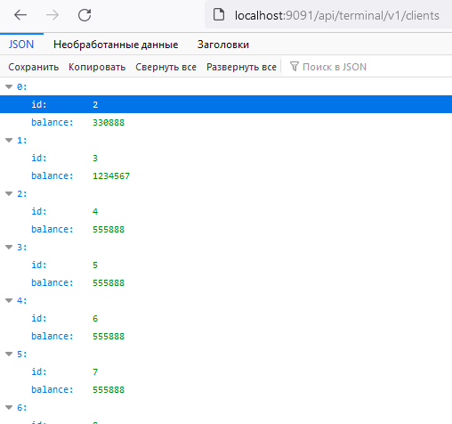

### ФИНАЛЬНЫЙ ПРОЕКТ
*Этап 1*

API для Интернет-банка  
Задача: реализовать Rest API по работе с банковским счетом.  
Это API будет использовать банкомат, веб-приложение или мобильное приложение Интернет-банка.  
Будут доступны следующие операции:
- Узнать баланс по ID пользователя;
- Снятие заданной суммы с баланса пользователя;
- Пополнение баланса на заданную сумму;
- Отобразить список операций за выбранный период;
- Перевести заданную сумму другому пользователю.

Ответ выдается в виде JSON.
___
Прежде чем подключаться к БД из программы, нужно в консоли PSQL настроить права доступа:
```
cd G:\prog\postgres\postgresql_14.1\pgsql\bin\
# синтаксис консоли Powershell 7 немного похож на Linux
.\psql -U postgres
# просмотрим всех пользователей
select * from pg_user;
# создадим пользлвателя с привилегиями управлять базами.
# Добавление новой роли (пользователя):
CREATE USER cash WITH PASSWORD 'myPass';
# даем права
GRANT ALL PRIVILEGES ON DATABASE "cash_machine" to cash;
# Теперь подключаемся к базе, к которой хотим дать доступ:
\c cash_machine
# Так мы добавим все права на использование всех таблиц в базе cash_machine учетной записи cash:
GRANT ALL PRIVILEGES ON ALL TABLES IN SCHEMA public TO "cash";
# вот так зададим роль Superuser (вероятно, с этого надо было и начать)
ALTER ROLE cash WITH Superuser;
# Выходим из SQL-оболочки:
\q
```

#### управляем жизненным циклом проекта в консоли:
```mvn spring-boot:run  
mvn spring-boot:run
# Builds with 4 threads
mvn -T 4 clean spring-boot:run
# 2 thread per cpu core
mvn -T 2C spring-boot:run
mvn package
mvn clean package
mvn -T 4 clean package
java -Dfile.encoding=windows-1251 -jar target/pos-0.0.1-SNAPSHOT.jar
mvn clean package spring-boot:repackage
# 
java -jar silent-0.0.1-SNAPSHOT.jar
```
#### Логин, пароль и порт берем из файла *application.properties*  
Соответственно, параметры подключения к базе данных можно изменить.  
А запустить .jar файл с указанием откуда читать *application.properties* можно так:  
```java -jar silent-0.0.1-SNAPSHOT.jar --spring.config.location=optional:file:./config/```
  
Например, в данном примере он находится в подкаталоге /config текущего каталога запуска.

просмотреть содержимое архива:  
```jar tvf target/pos-0.0.1-SNAPSHOT.jar```

Запускаем программу.
---
``` mvn -T 4 clean spring-boot:run ```  
Посмотрим как инициализировалась БД  

и выполним запрос:  
```select * from clients;```  
Тестируем REST API CRUD операции:
1. Создадим клиента. HTTP Method: POST
```curl -X POST -H "Content-Type: application/json" -d '{"balance":"10888"}' http://localhost:9091/api/terminal/v1/clients```
2. Найти клиента по ID REST API. HTTP Method: GET
```curl http://localhost:9091/api/terminal/v1/clients/2```
3. Найти всех клиентов REST API. HTTP Method: GET
```curl http://localhost:9091/api/terminal/v1/clients```
4. Обновить данные клиента REST API. HTTP Method: PUT
```curl -X PUT -H "Content-Type: application/json" -d '{"balance":"330888"}' "http://localhost:9091/api/terminal/v1/clients/2"```
5. Удалить клиента REST API HTTP Method: DELETE
```curl -X DELETE -H "Content-Type: application/json" http://localhost:9091/api/terminal/v1/clients/1```

Открываем веб-интерфейс нашего сервиса в браузере:  
```http://localhost:9091/api/terminal/v1/clients```  

